# Programming Poppy robots using Scratch

<!-- toc -->

Scratch is a blocks-based graphical programming language that allows users to create interactive animations, games, and more, while learning about mathematical and computational ideas.

Scratch could be used by both novice and more advanced users.

Scratch is open-source and it is entirely written in javascript, you can use it from the [official website](https://scratch.mit.edu/projects/editor/) but you can also use a [copy of the website](https://github.com/LLK/scratch-gui/wiki/Getting-Started) in your personal computer. It is a way more difficult but also possible by following the instructions.

## Introduction to Scratch programming

This chapter will focus on things necessary to understand in Scratch for using Poppy creatures.

### Connect your robot to Scratch

#### If you have a tangible robot

First, you must be connected to the same network LAN area than your robot (e.g. on the same router or Wifi).

You have to go on the web homepage of your robot with its URL. You can use its IP address (for example http://192.168.1.42) if you have a way to know it or its hostname like http://poppy.local. To find its IP address look at [the zeroconf chapter](../installation/install-zeroconf.md#alternatives-to-find-the-ip-address-of-a-computer-on-your-local-network). To use directly its hostname http://poppy.local you must have a Zeroconf software installed on your computer (aka ["Bonjour print services for Windows"](https://support.apple.com/kb/DL999?locale=en_US) if you are running Windows).

The home page of your poppy creature should look like the snapshot below:

Click on the "Programming" button then "Scratch" link to open the Scratch interface.

### Interface and general ideas

It is possible to change the language with the sphere button, on the right of the logo Scratch 

### Saving & importing project in Scratch

As this Scratch is a Virtual Machine, you can save and import your project only on your computer. 

> **Warning** It is not possible to share your project on the cloud as unofficial extension are still not yet supported on Scratch 3.0.

### Launch Poppy blocks

Poppy special blocks are stored in the Extension "Poppy". Push the Add Extension blue button at the lower left corner. 

Click on "Poppy" and all the blocks should appear in the Poppy category.

#### Network

First connect Scratch to your robot with the "set host" block. The host variable must be the IP or the hostname+".local" of your robot. Then test your connection with the (tangible or simulated) robot with the "test connection" block.

.

if the block answer is "You may have connection troubles", your "host" variable inside the Scratch project is probably wrong. 

### Build your own blocks!

It is now possible to create your own block by a combinaison of many blocks in Scratch 3.0. There is a My Blocks category to make a block.

You can choose three different options for your block : 
- Add an argument : it could be a number, a string or a Reporter block as 

- Add an boolean argument
- Add text or labels

For exemple if you want to create a block which plays a move and swicth on some LEDs of some motors, you can do it as it is shown below. 

> **Info** If you use a reporter block from the poppy extension in a command block 

 outside the poppy category block, you will have to use the "transform to string" button 
 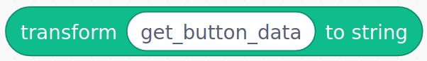 
 as you can see above.

## Description of Poppy blocks
|                                                            | Description                                                                                                                                                                                                                                                                                                                                                                                                                                                                      |
|------------------------------------------------------------|----------------------------------------------------------------------------------------------------------------------------------------------------------------------------------------------------------------------------------------------------------------------------------------------------------------------------------------------------------------------------------------------------------------------------------------------------------------------------------|
| 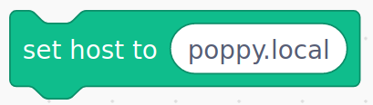                  | This block allows you to connect Scratch to your robot. The host input can accept : - robot_name.local (e.g. : poppy.local if your robot’s name is poppy)- the IP address (e.g. 169.254.145.25)                                                                                                                                                                                                                                                                                   |
| 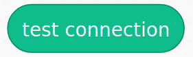           | Click on this block to verify that you are connected to your robot.                                                                                                                                                                                                                                                                                                                                                                                                              |
| 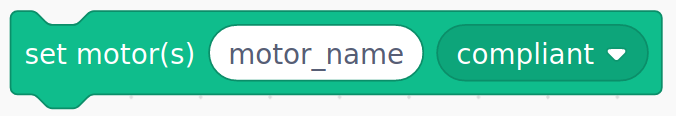      | Put one or many motors in compliant or stiff mode. Motors are hand-drivable in compliant mode but must be in stiff mode to controlled with Scratch. The “motor(s)” input can accept:- string of a motor name (e.g. m1) - string of many motors separated with spaces (e.g. m1 m2 m4)- a Scratch list of motors like the reporter block "all motors" or the block “list”                                                                                                       |
| 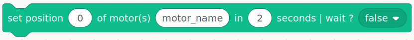              | Put one or many motors in a position (angle in degree) in a given time. The “motor(s)” input can accept: - string of a motor name (e.g. m1) - string of many motors separated with spaces (e.g. m1 m2 m4) - a Scratch list of motors like the reporter block "all motors" or the block “list”.  “Wait” can be true or false. If it’s on True, the action will wait the end of the previous action. If it’s on False, then the action will proceed during the previous one. |
| 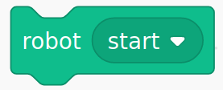                     | Restart the software inside the robot.                                                                                                                                                                                                                                                                                                                                                                                                                                           |
| 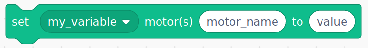     | Put the value to one register (position, speed, max torque, …) of one or many motors.                                                                                                                                                                                                                                                                                                                                                                                            |
| 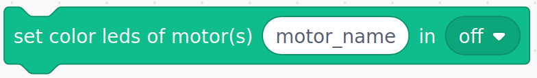                   | Activate/deactivate color leds of motors and choose the color of your choice.The “motor(s)” input can accept: - string of a motor name (e.g. m1) - string of many motors separated with spaces (e.g. m1 m2 m4) - a Scratch list of motors like the reporter block "all motors"" or the block “list”                                                                                                                                                                         |
|         | Play a movement at a given speed. It is necessary to indicate the exact name of the movement previously recorded. This block can be nested in the “concurrent/sequential” block.                                                                                                                                                                                                                                                                                                |
| 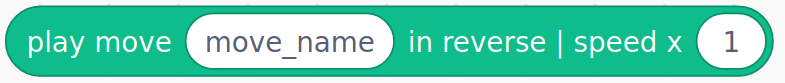      | Play a move in reverse at a given speed  (reporter block)
| 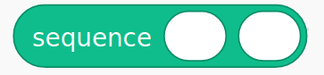                  | All blocks in input are run one after each other. You can use this block to play concurrently many sequently move.                                                                                                                                                                                                                                                                                                                                                                |
|                 | All reports input are run simultaneously. You can use this block to play concurrently many recorded move.                                                                                                                                                                                                                                                                                                                                                                         |
| 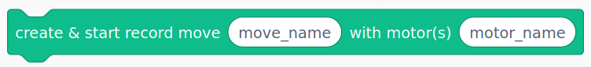   | Create and start a movement recorded by demonstration to the given motors.                                                                                                                                                                                                                                                                                                                                                                                                       |
|  | Stop a record and save the recorded move in the robot. Be careful, you must have previously defined a move record with the "create & start record move ..." block.                                                                                                                                                                                                                                                                                                               |
| 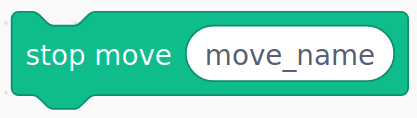                 | Stop a movement that is being played.                                                                                                                                                                                                                                                                                                                                                                                                                                            |
|     | Play movements at the same time (can be nested to concurrent block). Inputs can be : - move name (string) - any reporter block, like sequential or play sequentially                                                                                                                                                                                                                                                                       |
|    | Play movements following in order (can be nested to sequential block). Inputs can be :  - move name (string) - any reporter block, like sequential or play sequentially                                                                                                                                                                                                                                                                                                          |
| 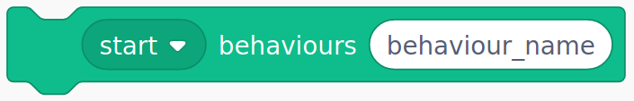          | Start/Stop/Pause/Resume an integrated behaviour of the robot. It can be a position, a movement, a sensorimotor loop, high level camera feature..                                                                                                                                                                                                                                                                                                                                 |
| 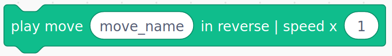      | Play a move in reverse at a given speed  (command block)                                                                                                                                                                                                                                                                                                                                                                                                                        |
|          | Play a move at a given speed (command block)                                                                                                                                                                                                                                                                                                                                                                                                                                     |
|            | Give motors which are in a given group. You can know groups name with the block “all motors groups”.                                                                                                                                                                                                                                                                                                                                                                             |
|                 | Return a list with the name of every motors in the robot.                                                                                                                                                                                                                                                                                                                                                                                                                        |
| 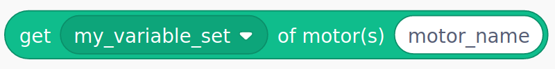              | Give the value of a register (position, speed, load, ... ) of one or many motors.                                                                                                                                                                                                                                                                                                                                                                                                |
|    | Give the position of every motors. It is a shortcut to the block above. It is useful to make a snapshot of pose of the robot.                                                                                                                                                                                                                                                                                                                                                    |
|             | Return the index of a motor name in the "all motors" block list.                                                                                                                                                                                                                                                                                                                                                                                                                 |
| 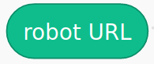                 | Give the URL of the robot. For internal use only.                                                                                                                                                                                                                                                                                                                                                                                                                                |
| 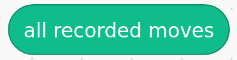        | Give all records stored in this robot.                                                                                                                                                                                                                                                                                                                                                                                                                                           |
|         | Give the list of all attached/running behaviours .                                                                                                                                                                                                                                                                                                                                                                                                                               |
|                           | Give all existing motors groups.                                                                                                                                                                                                                                                                                                                                                                                                                                                 |
|  | Get all methods or functions which are runnable in a behavior. It is an advanced block.                                                                                                                                                                                                                                                                                                                                                                                           |
|           | Return a boolean (true/false) depending if the selected card is detected by the camera of the robot.                                                                                                                                                                                                                                                                                                                                                                             |
|           | Display a popup with the chosen message.                                                                                                                                                                                                                                                                                                                                                                             |
|           | Transform the output of Poppy reporter block into string to be used with other basic Scratch command block as parameter.                                                                                                                                                                                                                                                                                                                                                                             |
|           | Call the REST API.                                                                                                                                                                                                                                                                                                                                                                             |
| 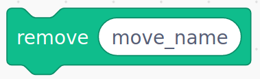          | Remove one or several recorded moves.                                                                                                                                                                                                                                                                                                                                                                             |
|           | Get the sitemap. Use the URL of the robot as parameter.                                                                                                                                                                                                                                                                                                                                                                             |

## Quick examples

You can find some exemples and activities on the web site [poppy education](https://www.poppy-education.org/activites/initiation-ergo-jr-et-scratch/) to record a movement by demonstration and play it back or how to use loops.

