# Programmer le robot Poppy avec Scratch

<!-- toc -->

Scratch est un langage de programmation graphique basé sur des blocs qui permet aux utilisateurs de créer des animations interactives, des jeux tout en apprenant des notions de mathématiques et d'informatiques.

Scratch est utilisable autant par les novices que les expérimentés.

Scratch est open-source et il est entièrement écrit en javascript, vous pouvez l'utiliser depuis le [site officiel](https://scratch.mit.edu/projects/editor/) mais vous pouvez également utiliser une [copie du site Web](https://github.com/LLK/scratch-gui/wiki/Getting-Started) sur votre ordinateur. 

## Introduction à la programmation Scratch

Cette partie vous apprendra le nécessaire pour utiliser les robots Poppy avec Scratch.

### Connecter son robot à Scratch

#### Si vous avez un robot physique

Tout d'abord, vous devez être connecté au même réseau que votre robot (par exemple sur le même routeur ou Wifi).

Vous devez vous rendre sur la page d'accueil Web de votre robot avec son URL. Vous pouvez utiliser son adresse IP (par exemple http://192.168.1.42) si vous avez un moyen de la connaître ou son nom d'hôte comme http://poppy.local. Pour trouver son adresse IP, regardez [le chapitre zeroconf](../installation/install-zeroconf.md#alternatives-to-find-the-ip-address-of-a-computer-on-your-local-network). Pour utiliser directement son nom d'hôte http://poppy.local vous devez avoir un logiciel Zeroconf installé sur votre ordinateur (aka ["Bonjour print services for Windows"](https://support.apple.com/kb/DL999?locale=en_US) si vous utilisez Windows).

La page d'accueil de votre robot Poppy doit ressembler à l'image ci-dessous:

Appuyez sur le bouton "Programming" puis "Scratch" pour ouvrir l'interface Scratch.

### Interface et points principaux

Il est possible de changer la langue avec le bouton sphère, à droite du logo Scratch 

### Sauvegarder et importer des projets Scratch

Comme ce Scratch est tourne entant que machine virtuelle, vous ne pouvez enregistrer et importer vos projets que sur votre ordinateur.

> **Warning** Il n'est pas possible de partager votre projet sur le cloud car les extensions non officielles ne sont pas encore prises en charge sur Scratch 3.0.

### Charger les blocs Poppy

Les blocs spéciaux Poppy sont stockés dans l'extension "Poppy". Appuyez sur le bouton bleu "Ajouter une extension" dans le coin inférieur gauche. 

Cliquez sur "Poppy" et tous les blocs devraient apparaître dans la catégorie Poppy.

#### Connexion

Connectez d'abord Scratch à votre robot avec le bloc "se connecter à". La variable hôte doit être l'adresse IP ou le nom d'hôte + ". Local" de votre robot. Testez ensuite votre connexion avec le robot (tangible ou simulé) avec le bloc «test de la connexion».
.
si le bloc vous renvoie "You may have connection troubles", votre variable "hôte" dans le projet Scratch est probablement erronée.

### Créez vos propre blocs !

Il est maintenant possible de créer votre propre bloc par une combinaison de plusieurs blocs dans Scratch 3.0. Il existe une catégorie Mes blocs pour créer un bloc.

Vous pouvez choisir trois options différentes pour votre bloc:
- Ajouter un argument: il peut s'agir d'un nombre, d'une chaîne ou d'un bloc Reporter comme 
- Ajouter un argument booléen
- Ajouter du texte

Par exemple, si vous souhaitez créer un bloc qui joue un mouvement et allume certaines LEDs de certains moteurs, vous pouvez le faire comme indiqué ci-dessous.

> **Info** Si vous utilisez un bloc reporter de l'extension poppy dans un bloc de commande  en dehors du bloc de catégorie poppy, vous devrez utiliser le bouton "transformer en string" 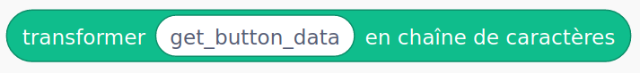 comme vous pouvez le voir ci-dessus.

## Description des blocs Poppy
|                                                            | Description                                                                                                                                                                                                                                                                                                                                                                                                                                                                      |
|------------------------------------------------------------|----------------------------------------------------------------------------------------------------------------------------------------------------------------------------------------------------------------------------------------------------------------------------------------------------------------------------------------------------------------------------------------------------------------------------------------------------------------------------------|
|                   | Ce bloc vous permet de connecter Scratch à votre robot. L’entrée de l’hôte peut accepter: - robot_name.local (par exemple: poppy.local si le nom de votre robot est poppy) - l’adresse IP (par exemple 169.254.145.25)                                                                                                                                                                                                                                                                                   |
|            | Cliquez sur ce bloc pour vérifier que vous êtes connecté à votre robot.                                                                                                                                                                                                                                                                                                                                                                                                              |
| 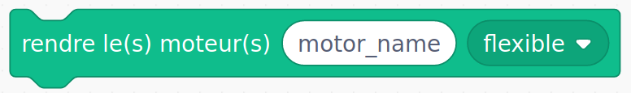      | Mettre un ou plusieurs moteurs en mode flexible ou rigide. Les moteurs sont pilotables manuellement en mode flexible mais doivent être en mode rigide pour être contrôlés avec Scratch. L'entrée «moteur (s)» peut accepter: - le nom d'un moteur (par exemple m1) - une chaîne de nombreux moteurs séparés par des espaces (par exemple m1 m2 m4) - une liste Scratch de moteurs comme le bloc reporter "tous les moteurs" ou le bloc "liste"                                                                                                                |
|               | Mettre un ou plusieurs moteurs dans une position (angle en degrés) en un temps donné. L'entrée «moteur (s)» peut accepter: - le nom d'un moteur (par exemple m1) - une chaîne de nombreux moteurs séparés par des espaces (par exemple m1 m2 m4) - une liste Scratch de moteurs comme le bloc reporter "tous les moteurs" ou le bloc "liste". Attendre peut être vrai ou faux. S'il est sur vrai, l'action attendra la fin de l'action précédente. Si elle est sur faux, alors l'action se poursuivra pendant la précédente.                                                                                                        |
| 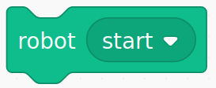                     | Redémarre le logiciel à l'intérieur du robot.                                                                                                                                                                                                                                                                                                                                                                                                                                           |
|      | Attribuer une valeur sur un registre (position, vitesse, couple max,…) d'un ou plusieurs moteurs.                                                                                                                                                                                                                                                                                                                                                                                            |
|                    | Active / désactive les leds de couleur des moteurs et choisissez la couleur de votre choix. L'entrée «moteur (s)» peut accepter: - le nom d'un moteur (par exemple m1) - une chaîne de nombreux moteurs séparés par des espaces (par exemple m1 m2 m4) - une liste Scratch de moteurs comme le bloc reporter "tous les moteurs" ou le bloc "liste"                                                                                                                                                                         |
| 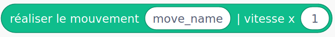        | Joue un mouvement à une vitesse donnée. Il est nécessaire d'indiquer le nom exact du mouvement précédemment enregistré. Ce bloc peut être imbriqué dans le bloc «concurrent / sequence».                                                                                                                                                                                                                                                                                                |
| 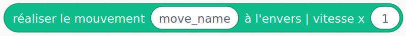      | Joue un mouvement en sens inverse à une vitesse donnée (bloc reporter)                                                                                                                                                               |
|                   | Tous les blocs en entrée sont exécutés les uns après les autres. Vous pouvez utiliser ce bloc pour lire simultanément plusieurs mouvements séquentiels.                                                                                                                                                                                                                                                                                                                                                                |
| 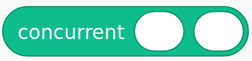                | Tous les blocs en entrée sont exécutés simultanément. Vous pouvez utiliser ce bloc pour jouer simultanément de nombreux mouvements enregistrés.                                                                                                                                                                                                                                                                                                                                                                         |
| 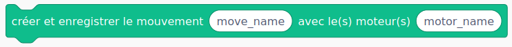   | Crée et démarre un mouvement enregistré par démonstration sur les moteurs donnés.                                                                                                                                                                                                                                                                                                                                                                                                       |
| 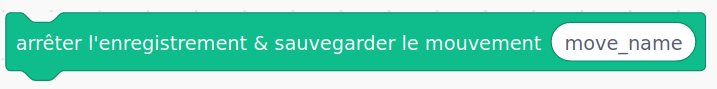 | Arrête un enregistrement et enregistre le mouvement dans le robot. Attention, vous devez avoir préalablement défini un enregistrement de mouvement avec le bloc "Créer et enregistrer le mouvement ..."                                                                                                                                                                                                                                                                                                               |
| 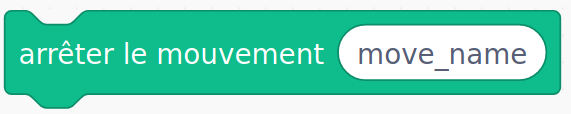                 | Arrête un mouvement en cours.                                                                                                                                                                                                                                                                                                                                                                                                                                            |
|     | Joue les mouvements en même temps (peut être imbriqué dans un bloc "concurrent"). Les entrées peuvent être: - nom de déplacement (string) - n'importe quel bloc reporter, comme sequence ou "jouer l'un après l'autre..."                                                                                                                                                                                                                                                                                                                           |
| 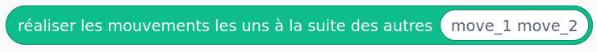   | Joue les mouvements dans l'ordre (peut être imbriqué dans un bloc "sequence"). Les entrées peuvent être: - nom de déplacement (string) - n'importe quel bloc reporter, comme sequence ou "jouer l'un après l'autre..."                                                                                                                                                                                                                                                                                                          |
|           | Démarrer / Arrêter / Pause / Reprendre un comportement intégré dans le robot. Cela peut être une position, un mouvement, une boucle sensorimotrice, une fonction de caméra de haut niveau..                                                                                                                                                                                                                                                                                                                                 |
| 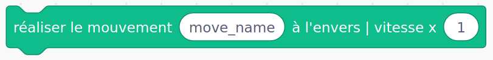      | Joue un mouvement en sens inverse à une vitesse donnée (bloc de commande)                                                                                                                                                                                                                                                                                                                                                                                                                        |
| 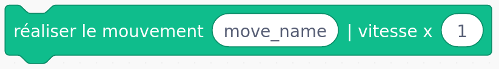         | Joue un mouvement à une vitesse donnée (bloc de commande)                                                                                                                                                                                                                                                                                                                                                                                                                                     |
| 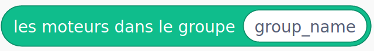           | Donne les moteurs qui sont dans un groupe donné. Vous pouvez connaître le nom des groupes avec le bloc «tous les groupes de moteurs».                                                                                                                                                                                                                                                                                                                                                                             |
| 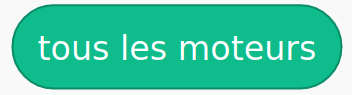                | Renvoie une liste avec le nom de tous les moteurs du robot.                                                                                                                                                                                                                                                                                                                                                                                                                        |
|               | Donne la valeur d'un registre (position, vitesse, charge, ...) d'un ou plusieurs moteurs.                                                                                                                                                                                                                                                                                                                                                                                                |
| 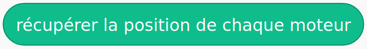   | Donne la position de tous les moteurs. C'est un raccourci vers le bloc ci-dessus.                                                                                                                                                                                                                                                                                                                                                    |
| 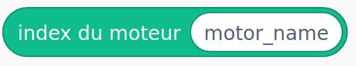            | Renvoie l'index d'un nom de moteur du bloc "tous les moteurs"                                                                                                                                                                                                                                                                                                                                                                                                                 |
|                  | Donne l'URL du robot. Pour usage interne uniquement.                                                                                                                                                                                                                                                                                                                                                                                                                                |
|         | Donne tous les enregistrements stockés dans ce robot.                                                                                                                                                                                                                                                                                                                                                                                                                                           |
| 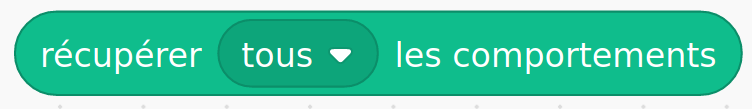        | Donne la liste de tous les comportements et ceux en cours d'exécution.                                                                                                                                                                                                                                                                                                                                                                                                                               |
| 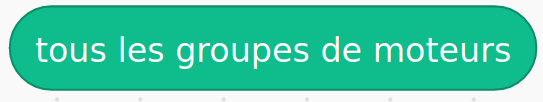                          | Donne tous les groupes de moteurs existants.                                                                                                                                                                                                                                                                                                                                                                                                                                                 |
| 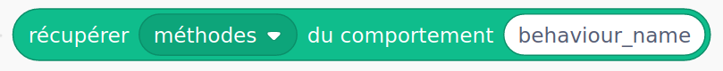 | Récupère toutes les méthodes ou fonctions exécutables d'un comportement. C'est un bloc avancé.                                                                                                                                                                                                                                                                                                                                                                                           |
|           | Renvoie un booléen (vrai / faux) selon que la carte sélectionnée est détectée par la caméra du robot.                                                                                                                                                                                                                                                                                                                                                                             |
|           | Afficher une popup avec le message choisi.                                                                                                                                                                                                                                                                                                                                                                             |
|           | Transforme la sortie des blocs Poppy reporter en string pour être utilisée avec un autre bloc de commande Scratch de base en tant que paramètre.                                                                                                                                                                                                                                                                                                                                                                             |
|           | Appel l'API REST.                                                                                                                                                                                                                                                                                                                                                                             |
|           | Supprime un ou plusieurs mouvements enregistrés.                                                                                                                                                                                                                                                                                                                                                                             |
|           | Obtene le sitemap. Utilisez l'URL du robot comme paramètre.                                                                                                                                                                                                                                                                                                                                                                             |

## Quelques exemples

Vous pouvez trouver quelques exemples et activités sur le site [poppy education](https://www.poppy-education.org/activites/initiation-ergo-jr-et-scratch/) pour enregistrer un mouvement par démonstration et le lire ou comment pour utiliser des boucles.

